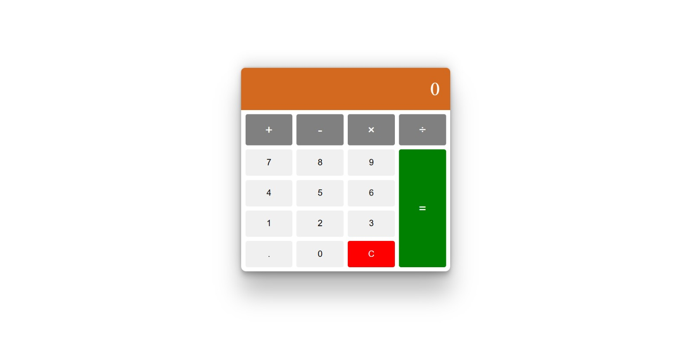

# 📟 Basit Hesap Makinesi

Bu proje, temel matematiksel işlemleri yapabilen modern ve kullanıcı dostu bir hesap makinesi uygulamasıdır. HTML, CSS ve JavaScript kullanılarak geliştirilmiştir.

---

## 🚀 Özellikler

- Toplama, çıkarma, çarpma ve bölme işlemleri
- Ondalıklı sayı desteği (`.` ile)
- Sonucu hesaplama (`=` butonu)
- Temizleme/Clear fonksiyonu (`C` butonu)
- Modern, şık ve responsive tasarım

---

## 🛠️ Kullanılan Teknolojiler

- HTML5  
- CSS3  
- Vanilla JavaScript

---

